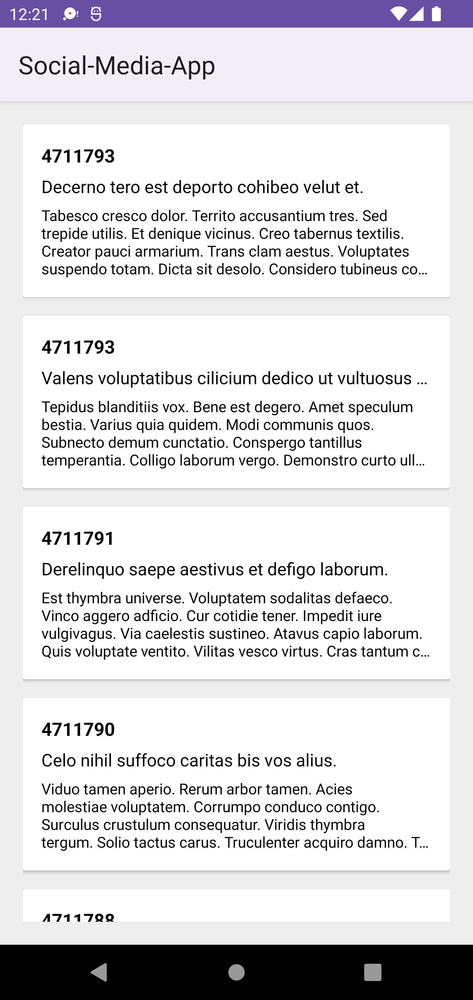
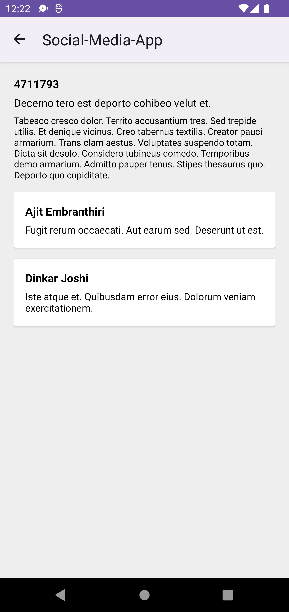

# Social-Media-App
Android application that consuming (https://gorest.co.in).  
It has been built with clean architecture principles, Repository Pattern, and MVVM pattern as well as Architecture Components.

## Demo
<table>
  <tr>
   <td> </td>
   <td> </td>
</tr> 
</table>

## Architecture
Uses concepts of the Uncle Bob's architecture [Clean Architecture](https://blog.cleancoder.com/uncle-bob/2012/08/13/the-clean-architecture.html). 

## Built With 🛠

- [Kotlin](https://kotlinlang.org/) First class and official programming language for Android development.
- [Coroutines](https://github.com/Kotlin/kotlinx.coroutines) - A coroutine is a concurrency design pattern that you can use on Android to simplify code that executes asynchronously
- [Dagger-Hilt](https://developer.android.com/training/dependency-injection/hilt-android) - For dependency injection.
- [JetPack](https://developer.android.com/jetpack) Suite of libraries to help developers follow best practices.
  - [Lifecycle](https://developer.android.com/jetpack/androidx/releases/lifecycle) - Used get lifecyle event of an activity or fragment and performs some action in response to change
  - [ViewModel](https://developer.android.com/topic/libraries/architecture/viewmodel) - Stores UI-related data that isn't destroyed on UI changes. 
  - [Navigation](https://developer.android.com/guide/navigation/navigation-getting-started) - Used to navigate between fragments.
- [Retrofit](https://github.com/square/retrofit) - Used for REST api communication.

## Contributions
Please feel free to file an issue for errors, suggestions or feature requests.

